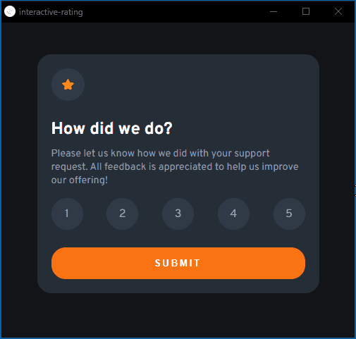

# Frontend Mentor - solução de componente de QR code

Esta é uma solução para o [desafio do componente de código QR no Frontend Mentor](https://www.frontendmentor.io/challenges/interactive-rating-component-koxpeBUmI).

## Índice

- [Visão geral](#visão-geral)
  - [Captura de tela](#screenshot)
  - [Links](#links)
- [Meu processo](#meu-processo)
  - [Construído com](#construído-com)
  - [O que aprendi](#o-que-eu-aprendi)
- [Autor](#autor)

## Visão geral

### Screenshot

### Links

- Código: (https://github.com/eduardonobrega/frontend-mentor/tree/main/interactive-rating-component)
- Site ao vivo: (https://eduardonobrega.github.io/frontend-mentor/interactive-rating-component/)

## Meu processo

### Construído com
- Marcação HTML5 semântica
- Propriedades personalizadas de CSS
- JavaScript

### O que eu aprendi

Meu primeiro projeto utiizando JavaScript! Simples, mas ajudou a colocar o conhecimento em prática.

## Autor

- Github - [@eduardonobrega](https://github.com/eduardonobrega)
- Frontend Mentor - [@eduardonobrega](https://www.frontendmentor.io/profile/eduardonobrega)
