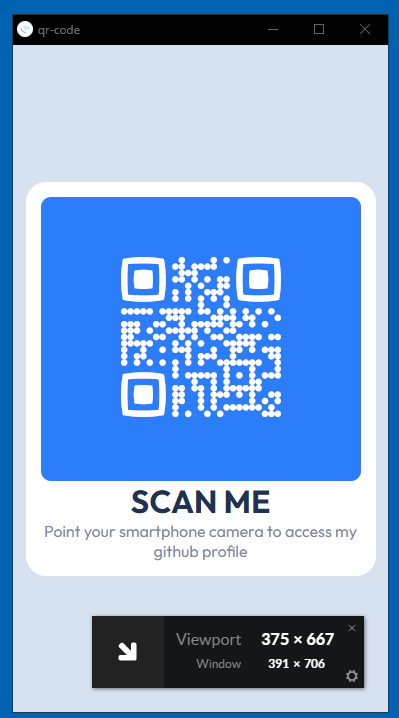

# Frontend Mentor - solução de componente de QR code

Esta é uma solução para o [desafio do componente de código QR no Frontend Mentor](https://www.frontendmentor.io/challenges/qr-code-component-iux_sIO_H).

## Índice

- [Visão geral](#visão-geral)
  - [Captura de tela](#screenshot)
  - [Links](#links)
- [Meu processo](#meu-processo)
  - [Construído com](#construído-com)
  - [O que aprendi](#o-que-eu-aprendi)
  - [Recursos úteis](#recursos-úteis)
- [Autor](#autor)

## Visão geral

### Screenshot

### Links

- Código: (https://github.com/eduardonobrega/html-css/tree/main/desafios/qr-code)
- Site ao vivo: (https://eduardonobrega.github.io/html-css/desafios/qr-code/)

## Meu processo

### Construído com
- Marcação HTML5 semântica
- Propriedades personalizadas de CSS

### O que eu aprendi

Foi nescessário uma pesquisa para saber como gerar um qr code, foi útil para o projeto e me será útil para projetos futuros.

consegui revisar conseitos de alinhamento horizontal e vertical, resposividade mais básicos que não foram nescessário o uso de Media queries.

### Recursos úteis

QR Code Generator - (https://www.qr-code-generator.com/)
com o ele consegui criar grátis um qr code FUNCIONAL e PERSONALIZAVEL

## Autor

- Github - [@eduardonobrega](https://github.com/eduardonobrega)
- Frontend Mentor - [@eduardonobrega](https://www.frontendmentor.io/profile/eduardonobrega)